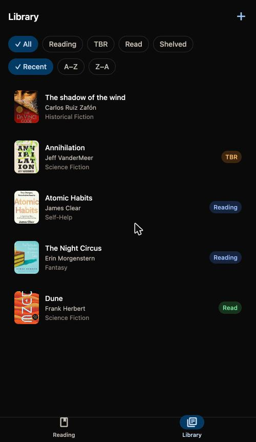
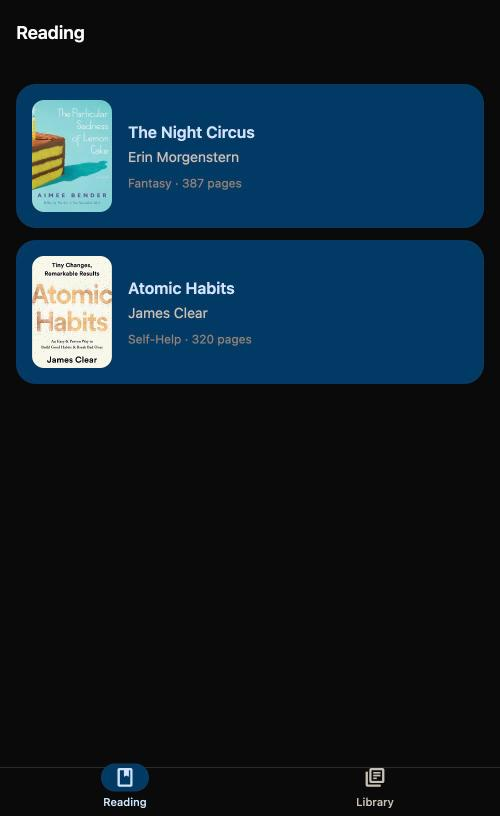
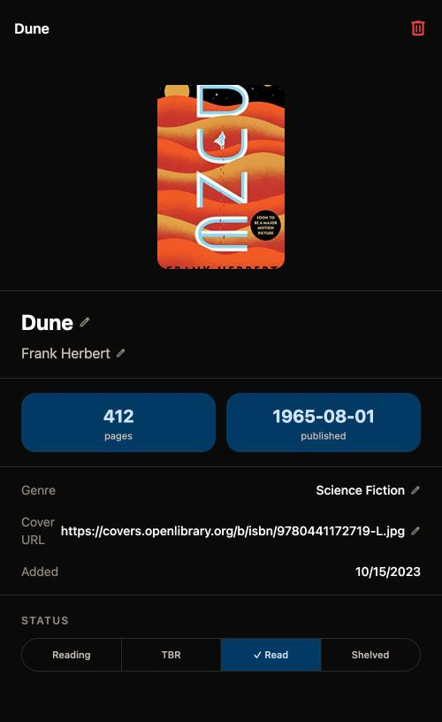
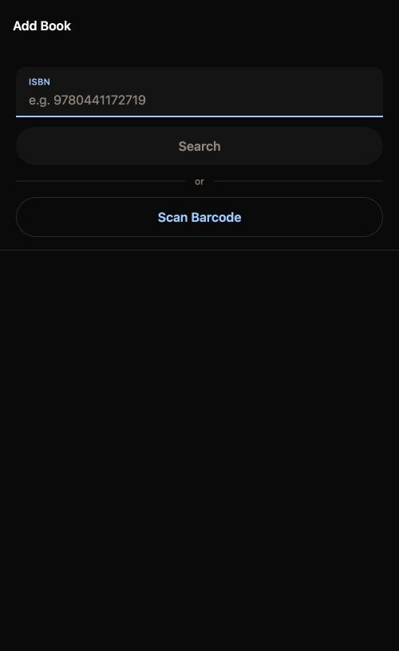

# Library Archive

A minimal, offline-first book tracker for your home library. Scan the barcodes on your shelf, watch your collection populate itself, and keep tabs on what you're reading — no account, no sync, no cloud. Everything lives on your device.

Built for a Google Pixel, as a from-scratch exercise in AI-assisted app development: five build phases, taken from a static mock-data prototype to a fully persisted, camera-driven, themeable app.

<p align="center">
  
  
  
  
</p>

## Why this exists

Cataloging a physical library by hand is tedious enough that most people never finish it. The entire point of this app is to remove friction from that one task: point the camera at a barcode, and the book — title, author, cover, genre, page count, publish date — appears in your library seconds later, pulled from a live book database instead of typed in by hand. Everything after that (sorting, filtering, tracking what you're reading) is secondary to that core loop.

No login screen, no backend, no analytics. The data model is intentionally small — one `books` table, one status field — because the goal is a fast personal tool, not a platform.

## What it does

- **Scan your shelf.** Point the camera at a barcode and the book gets looked up automatically. A bulk mode lets you scan an entire shelf in one continuous pass — scan, confirm, scan again — then commit everything at once.
- **Look books up two ways if you don't have the physical copy in hand.** Type an ISBN and it's resolved the same way scanning does (Open Library first, Google Books as a fallback), or skip lookup entirely and enter a book's details by hand.
- **Track what you're reading.** A dedicated Reading tab surfaces just the books with `reading` status — no digging through the full catalog to see what's currently open on your nightstand.
- **Browse and filter the full library.** Filter by status (Shelved / Reading / TBR / Read) and sort alphabetically, reverse-alphabetically, or by recency.
- **Edit anything, inline.** Every field on a book — title, author, genre, page count, publish date, cover URL, status — is tap-to-edit directly on the detail screen. No separate edit mode, no form to submit.
- **Everything persists offline.** A local SQLite database is the source of truth; the in-memory state and the database are always kept in sync, so closing the app never loses a change.

## Screens

| Screen | Route | What it's for |
|---|---|---|
| **Reading** | `app/(tabs)/index.tsx` | Just the books currently marked "Reading" — the default landing tab |
| **Library** | `app/(tabs)/library.tsx` | The full collection, with status filters and sort controls |
| **Book Detail** | `app/book/[id].tsx` | Every field editable inline; status changed via a picker |
| **Add Book** | `app/add.tsx` | ISBN search → preview → confirm, with links out to scanning or manual entry |
| **Scan** | `app/scan.tsx` | Live barcode scanning, single or bulk (queue-then-confirm) |
| **Manual Entry** | `app/manual-entry.tsx` | Hand-typed fallback when a book isn't found in either API |

## Tech stack

| Layer | Choice | Why |
|---|---|---|
| Framework | [Expo](https://expo.dev) (React Native, managed workflow) | One codebase, native camera + SQLite access, no native build step during development |
| Language | TypeScript | The `Book` interface is the contract every screen, store, and DB call agrees on |
| Routing | Expo Router | File-based routes keep the six screens above self-evident from the folder structure |
| Styling | NativeWind (Tailwind for React Native) | Utility classes without hand-rolled `StyleSheet` objects; a structured token set (`accent`, `surface`, `ink`, `status`) in `tailwind.config.js` drives the whole app's Material 3 / OLED-black theme |
| State | Zustand | One small store holding the in-memory book list, hydrated from SQLite on launch |
| Persistence | `expo-sqlite` | Local, offline, no server — every add/edit/status-change writes straight to disk |
| Barcode scanning | `expo-camera` | Native scanner performance, no extra permissions beyond camera |
| Book lookup | Open Library API → Google Books API → manual entry | Open Library needs no API key; Google Books fills gaps Open Library misses; manual entry is the last resort when neither has the book |

## Getting started

```bash
npm install

npx expo start            # dev server — scan the QR with Expo Go, or...
npx expo start --android  # ...open directly on a connected Android device
npx expo start --web      # ...or preview in a browser (UI-only: falls back to
                           # in-memory mock data, since SQLite is Android-only here)

npx tsc --noEmit          # type-check
```

## Project structure

```
app/                  Expo Router screens (file-based routing)
  (tabs)/               Reading + Library tab navigator
  book/[id].tsx          Book detail
  add.tsx, scan.tsx, manual-entry.tsx    Add-book flows

src/
  components/           BookCard, FilterBar — shared UI
  services/              openLibrary.ts, googleBooks.ts, bookLookup.ts, database.ts
  store/                 Zustand store (bookStore.ts)
  types/                 The canonical Book interface
  data/                  mock-books.json — seed data for first launch

docs/                  Planning docs (project plan, tech stack, screenshots)
inspo/                 UI direction mockups and design references (see below)
```

## Design direction

The current theme — Material 3 components, an OLED-black default, a blue accent — came out of an explicit UI exploration rather than ad-hoc styling choices, and is now applied throughout the app itself (not just mocked up): filled text fields, filter chips, a segmented status picker, and a pill-indicator nav bar all live in the actual screens above. `inspo/mockups/ui-direction-material-crisp.html` is the self-contained, interactive comp it started from (open it directly in a browser) with a live accent switcher for comparing orange/purple/green/blue side by side, plus notes on why each option does or doesn't collide with the app's existing status colors. `inspo/references/` holds the original inspiration screenshots that shaped it.

That same comp is also published as a hosted [Claude artifact](https://claude.ai/code/artifact/521d588b-11f0-4a76-9c32-444de54ce74f) — the fastest way to click through the four color directions without cloning the repo.

## Status

All five planned build phases are complete:

1. ✅ Static prototype with mock data
2. ✅ Book detail view + Zustand state
3. ✅ Book lookup via Open Library (with Google Books fallback)
4. ✅ Camera/barcode scanning, including bulk scan-and-confirm
5. ✅ SQLite persistence

See `DEVLOG.md` for the full session-by-session history and the reasoning behind non-obvious decisions along the way.

## Repository Topics
`book-tracker` `home-library` `barcode-scanner` `reading-list` `minimal-ui`
